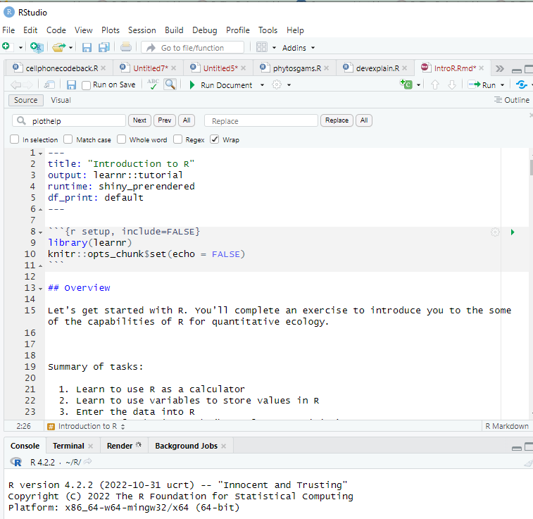

```{r setup, include=FALSE}
library(learnr)
knitr::opts_chunk$set(echo = FALSE)
```

## Overview

Let’s get started with R. You’ll complete an exercise to introduce you to the some of the capabilities of R for quantitative ecology.

 Summary of tasks:

  1. Learn to use R as a calculator
  2. Learn to use variables to store values in R
  3. Enter the data into R
  4. Create of a basic graph (best plot competition)
  5. Interpret your plot

Today, we’re going to focus on making the most informative, and visually compelling graph of data related to the Western Chorus frog in Ontario. In order to even get to plotting though, we’ll have to learn a bit about R first.

### Getting into R

To begin, if you have previously installed R on your personal computer, or created an openR account you can download this .Rmd file and run it locally, or simply follow along with the text and enter your code manually.

 
If you are running an instance of R, when you first open it you will see the Console window.

 
 
 

 

 

Or, if you have installed and opened Rstudio, you’ll see something like this:

 

 
 
 

where the console window is the pane at the bottom left.

 

Expressions that you enter in this window will be executed immediately by the program. The Console window can be used interactively, just like a sophisticated calculator. 

Next week we will use the console window directly (or this week if you are brave). Otherwise, remember you can download the .Rmd file of this tutorial, open the file and hit "Run Document" to try out the code in a friendly way.

 
## R as a calculator

We can use the following standard operators to complete simple calculations in R

'+'  addition

'-' subtraction, negative

'*' multiplication

'/'  division (1/2=0.5)

'^' exponentiation

 Let's try. See if you can write the code to evaluate 2+2
 
```{r two-plus-two, exercise=TRUE}

```

Fabulous! Once you have the hang of it, try other tasks like 

* Add 4 to 843
* Subtract 56 from 39
* Divide 20 by 3
* Square 8

```{r other-arithmetic, exercise=TRUE, exercise.lines = 5}
#add your code here
```
 

R uses standard order of operations, you can alter this with the use of parentheses

Compare 5 +2^2 to (5+2)^2

Let's try

```{r op-order, exercise=TRUE}
5 +2^2

```

```{r quiz}
quiz(
  question("To manually calculate the mean value of 10.3, 12.4, and 14.5 in the R Console window, you would type _________",
    answer("(10.3,12.4,14.5)/3"),
    answer("(10.3+12.4+14.5)./.3"),
    answer("(10.3+12.4+14.5)/3", correct = TRUE),
    answer("10.3+12.4+14.5/3")
  )
)
```  
 
## Variables in R

Like a calculator or other computer languages, R can store values for future use. What happens when you type pi?

  
```{r pi, exercise=TRUE}
pi
```

You can also store your own information using a name that indicates to R that you would like to put information at a particular memory location. The assignment statement a<-10  or a=10 will store the value 10 at the memory location referred to by the letter “a”. Be aware that there will be no immediate visible result, but from now on, a has the value 10 and can be used in arithmetic expressions.

 
```{r a, exercise=TRUE}
a=10

#add your code here
```

* What happens when you type a?
* How about a/5?
* a*a?

 

R will overwrite that memory location if you ask it to. 

* What happens when you enter a<-2000?

```{r achange, exercise=TRUE}

#add your code here
```


So we see that the memory location we indicated “a” can contain any value we set. It is a variable. A reference to a memory location that can store that can store any value (N.B. this is a computational definition of variable and differs from the mathematical definition). 

 

R is “case sensitive” so that it will perceive “a” and “A” as different variables.

* What happens when you type A?

```{r aformat, exercise=TRUE}
a=10
A
```


You have lots of flexibility in naming your variables, all alpha characters and digits are allowed, as well as the symbols “.” and “_”. However, your variable names cannot start with a digit or a period followed by a digit. Make variable names long enough to remember, short enough to type. N.per.ha or pop.density are better than x and y (too short) or available.nitrogen.per.hectare (too long). 

You should be wary of using the same variable name that R uses for one of its own functions or memory items. Avoid c, l, q, t, C, D, F, I, and T, which are either built-in R functions or hard to tell apart. 

If you make a mistake, the function rm() can be used to remove a variable. 

## Entering data in R

R is not the best for entering data, but for small datasets it is not too bad. For entering small sets of data (e.g., your x variable) we can use a single variable name and the function c() to combine the observations in a vector. Once entered, we can begin to manipulate the data

For example, enter ds<-c(10,12,15,16,23) and then type ds. What do you see? 
```{r dvec, exercise=TRUE}

#add your code here
```

These variables are vectors of values.
We are going to use this approach to enter the data for your first graph

### OUr Western Chorus frog data

Audio surveys were conducted in the Great Lakes region of Ontario to determine if the calls of the Western Chorus frog were present (COSEWIC 2008). The data were record as the percentage of surveys that detected Western Chorus frog calls each year. See below.

**Table 1 Percent of audio surveys in the Great Lakes region of Ontario that detected Western Chorus frog calls**

|year|% of surveys|
|----|-----|
|1995|78.35|
|1996|	71.67|
|1997|	65.97|
|1998|	61.74|
|1999|	36.32|
|2000|	33.71|
|2001|	30.46|
|2002|	56.78|
|2003|	28.18|
|2004|	24.76|
|2005|	35.2|
|2006|	30.64|


Enter your data as two different vectors: one for year, and one for the surveys

```{r surveydata, exercise=TRUE, exercise.lines=5}

#add your code here
```

## Basic plotting in R

Now you have the relevant data stored as variables in R’s memory. You want to plot this data.
A bare bones plot is obtained by typing plot(y=whatInamedy, x=whatInamedx). Try it!

```{r first_plot, exercise=TRUE, exercise.lines = 5}

#add your code here
```


Any problems? Make sure all the data looks reasonable (e.g., do you have the y variable on the vertical axis?)

### Pimp my plot

Now the fun part. We’ll use the options available for plot to create a better, more informative graph. For example, we need better axis labels. We can modify our plot command to include a direction regarding these labels as which as in plot(y=whatInamedy, x=whatInamedx, xlab=”good x label”, ylab=”good y label”).

For example, here's a graph of coffee consumption and happiness

```{r plotex, fig.cap="Fig 1: Coffee=Happiness", fig.align="center", exercise=TRUE,exercise.eval=TRUE}
coffee=c(1,2,3,6,8,10)
happy=c(0,1,5,8,6,1)
plot(x=coffee, y=happy, xlab="cups of coffee per day", 
     ylab="happiness on a 10 point scale", 
     col="blue", pch=16)
```


 

We can add colour (plot(y=whatInamedy, x=whatInamedx, col=”red”)), change the symbols plot(y=whatInamedy, x=whatInamedx, pch=22)), use a line instead of symbols (although I don't recommend that for data), plot on the log scale etc etc etc.

Type ?plot.default and select generic x-y plotting to get an explanation of how plot works (if you find the R help too cryptic, also check out Dyer 4.1).

```{r plothelp, exercise=TRUE}
#Enter your call for help here
```

First, notice that we did not enter the whole long list of arguments that plot can take (e.g. axis labels, symbol type, line widths, titles etc etc), instead we relied on the default values of these arguments. You can see some of these defaults by reading the R help function on plot. For those arguments that you did not enter, R assumes you wish to use the default values.


```{r plotpimpquiz}
quiz(
  question("to create solid green data points on my graph I would add ____ to the plot options",
    answer("pch=16, col=3", correct = TRUE),
    answer("pch=22, col='green'"),
    answer("col='green'"),
    answer("pch=4, col=6")
)
)
```


### Adding different data to the same plot 

You could get really sophisticated. For example, you could a second source of survey data to the plot using the points() function, and then use a different symbol and a legend to indicate the different sources of your population data using the legend() function.

Here's an example of adding my fried Fred's coffee data to my original data. Fred hates coffee, but he drinks it to stay up late and finish experiments.

```{r plotchoc,  fig.cap="\\{bold}{Fig 2: Just the right amount of coffee=happiness}", fig.align="center",exercise=TRUE, exercise.eval=TRUE}
coffee=c(1,2,3,6,8,10)
happy=c(0,1,5,8,6,1)
coffeefred=c(1,2,3,6,8,10)
happyfred=c(6,4,5,3,2,0)
plot(x=coffee, y=happy, xlab="cups of coffee per day", ylab="happiness on a 10 point scale", col="blue", pch=16)
points(x=coffeefred, y=happyfred, col="red", pch=24)

legend("topright", legend=c("Me", "Fred"), col=c("blue", "red"), pch=c(16,24))
```


Now you try.

Here's the survey data for the Western Chorus frog from the Carolinian region of Ontario for comparison.

**Table 2 Percent of audio surveys in the Carolinian region of Ontario that detected Western Chorus frog calls**

|year|% of surveys|
|----|-----|
|1995|	12.62|
|1996|	33.99|
|1997|	39.98|
|1998|	41.63|
|1999|	47.86|
|2000|	46.86|
|2001|	59.34|
|2002|	41.75|
|2003|	28.49|
|2004|	55.40|
|2005|	47.19|
|2006|	26.72|

```{r withextra, exercise=TRUE, exercise.lines = 15}
#Enter your call for help here
```


Try your best, then compare the beauty of your plot to that of the nearest group.

## Interpret my plot

Beauty isn’t everything! Now try and interpret your graph.

You may want to refer to the original COSEWIC (2008) report that uses this data. What is the current status of the Western Chorus frog and why?


```{r quiz2}
quiz(
  question("What is probably happening to the Western Chorus frog population in the Great Lakes region?",
    answer("it is decreasing", correct = TRUE),
    answer("it is increasing"),
    answer("it is staying about the same")
  ), 
  question("What about the population of frogs in the Carolinean region?",
    answer("it is decreasing"),
    answer("it is increasing"),
    answer("it is staying about the same", correct = TRUE)
  ) 
    
  
)


```

### References

COSEWIC (2008). Assessment and update status report on the Western chorus frog *Pseudacris triseriata* in Canada. Ottawa, Committee on the Status of Endangered Wildlife in Canada. vii: 47.
[https://publications.gc.ca/collections/collection_2008/ec/CW69-14-540-2008E.pdf](https://publications.gc.ca/collections/collection_2008/ec/CW69-14-540-2008E.pdf)